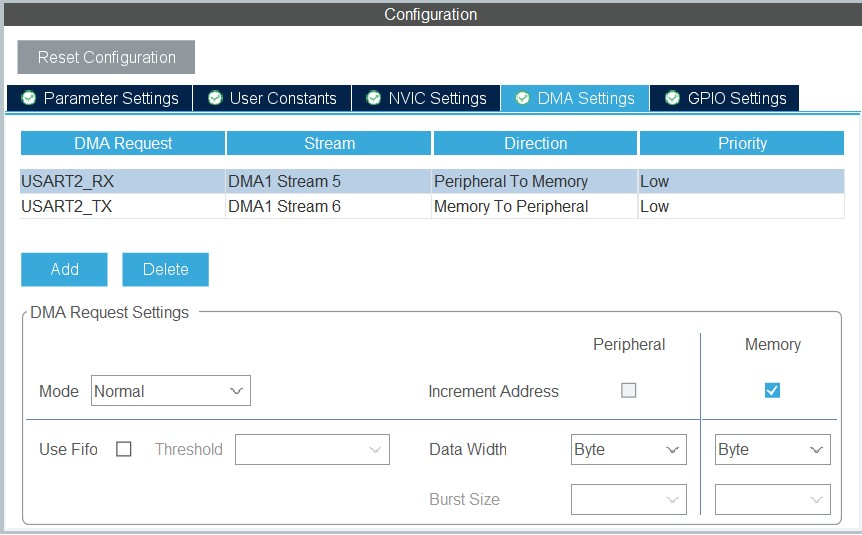

# 串口配置

## 目录

[1. STM32CubeIDE设置阻塞式串口收发（HAL库）](#1-stm32cubeide设置阻塞式串口收发hal库)</br>
[----1.1 图形化配置串口](#11-图形化配置串口)</br>
[----1.2 printf函数重定向](#12-printf函数重定向)</br>
[--------1.2.1 重定向代码](#121-重定向代码)</br>
[--------1.2.2 使用FreeRTOS产生的问题](#122-使用freertos产生的问题)</br>
[----1.3 中断服务函数代码](#13-中断服务函数代码)</br>
[--------1.3.1 使用FreeRTOS的情况](#131-使用freertos的情况)</br>
[--------1.3.2 不使用FreeRTOS的情况](#132-不使用freertos的情况)</br>
[----1.4 数据处理函数](#14-数据处理函数)</br>
[--------1.4.1 FreeRTOS任务函数](#141-freertos任务函数)</br>
[--------1.4.2 串口回调函数](#142-串口回调函数)</br>


## 1. STM32CubeIDE设置阻塞式串口收发（HAL库）

### 1.1 图形化配置串口


### 1.2 printf函数重定向

#### 1.2.1 重定向代码

```c
#ifdef __GNUC__
  #define PUTCHAR_PROTOTYPE int __io_putchar(int ch)
#else
  #define PUTCHAR_PROTOTYPE int fputc(int ch, FILE *f)
#endif

PUTCHAR_PROTOTYPE
{
    HAL_UART_Transmit(&huart2, (uint8_t*)&ch, 1, HAL_MAX_DELAY);
    return ch;
}
__attribute__((weak))int _write(int file, char *ptr, int len)
{
    if(HAL_UART_Transmit(&huart2,ptr,len,0xffff)!=HAL_OK)
    Error_Handler();
}
```

#### 1.2.2 使用FreeRTOS产生的问题

* 加上了重定向函数依旧无法打印出任何数据
---->可以在不同地方写上printf，比如一个FreeRTOS的任务函数里面、串口接收中断函数里面，没有用FreeRTOS的时候在while(1)里面写上printf，这样做是为了排除可能影响printf正常输出的因素。

* 只重写fputc函数不行吗？
---->在STM32CubeIDE里面是不行的。因为STM32CubeIDE是基于gcc编译器和Elipse编辑器构建起来的软件，不像使用ARMcompiler的Keil可以通过重写fputc函数来重定向printf，所以STM32CubeIDE里面必须重写gcc编译器关注的_write()函数。

### 1.3 中断服务函数代码

#### 1.3.1 使用FreeRTOS的情况

```c
void USART2_IRQHandler(void)
{
    /* USER CODE BEGIN USART2_IRQn 0 */
    BaseType_t xHigherPriorityTaskWoken;
    /* USER CODE END USART2_IRQn 0 */
    HAL_UART_IRQHandler(&huart2);
    /* USER CODE BEGIN USART2_IRQn 1 */
    HAL_UART_Receive_IT(&huart2,(uint8_t *)&BLEUsartRxBuffer,1);
    //	while(HAL_UART_GetState(&huart2)!=HAL_UART_STATE_READY){}
    xQueueSendFromISR(BLEUsartRxQueueHandle,&BLEUsartRxBuffer,&xHigherPriorityTaskWoken);
    portYIELD_FROM_ISR( xHigherPriorityTaskWoken );
    /* USER CODE END USART2_IRQn 1 */
}
```

这几行代码的顺序非常有讲究。
必须要先调用`HAL_UART_IRQHandler()`来处理中断标志等，
再调用`HAL_UART_Receive_IT()`来开启下一次中断，
之后才能进行数据的发送或处理等。
**否则**，就会出现第一个接收到的字符是0x00,然后后面的字符全部都延迟一次中断，比如发送「123」,显示收到「  12」，再发一次「123」，显示收到「312」，后面每次发「123」都显示收到「312」。

#### 1.3.2 不使用FreeRTOS的情况

```c
void USART2_IRQHandler(void)
{
    HAL_UART_IRQHandler(&UART1_Handler);
    while (HAL_UART_GetState(&UART1_Handler) != HAL_UART_STATE_READY);
    while(HAL_UART_Receive_IT(&UART1_Handler, (uint8_t *)aRxBuffer,RXBUFFERSIZE)!= HAL_OK);
}
```

不使用FreeRTOS的话，需要在串口回调函数里面实现数据处理，所以中断函数只是很简单的处理一下中断标志之类的。

### 1.4 数据处理函数

#### 1.4.1 FreeRTOS任务函数

```c
void BLE_Receive(void const * argument)
{
    /* USER CODE BEGIN BLE_Receive */
    uint8_t Res;
    BaseType_t Return;
    /* Infinite loop */
    while(1)
    {
        Return = xQueueReceive(BLEUsartRxQueueHandle,&Res,portMAX_DELAY);
        if(Return == pdPASS)
        {
            printf("received:%c\r\n",Res);
        }
        else
        {
            printf("received error\r\n");
        }
    }
    /* USER CODE END BLE_Receive */
}
```
这是一个很简单的测试任务，就是把接受到的数据回显，只不过是一个一个字符进行回显。

#### 1.4.2 串口回调函数

```c
void HAL_UART_RxCpltCallback(UART_HandleTypeDef *huart)
{
    if(huart->Instance==USART1)
    {
        if((USART_RX_STA&0x8000)==0)
        {
            if(USART_RX_STA&0x4000)
            {
                if(aRxBuffer[0]!=0x0a)USART_RX_STA=0;
                else USART_RX_STA|=0x8000;
            }
            else
            {	
                if(aRxBuffer[0]==0x0d)USART_RX_STA|=0x4000;
                else
                {
                    USART_RX_BUF[USART_RX_STA&0X3FFF]=aRxBuffer[0] ;
                    USART_RX_STA++;
                    if(USART_RX_STA>(USART_REC_LEN-1))USART_RX_STA=0;
                }		 
            }
        }
    }
}
```

这是正点原子HAL库的函数

## 2. STM32CubeIDE设置DMA串口收发（HAL库）

### 2.1 图形化配置串口



### 2.2 

## Keil5（固件库）