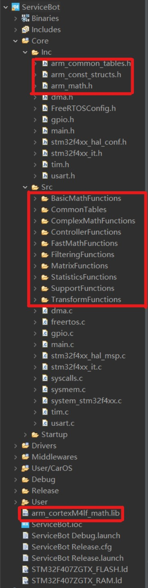
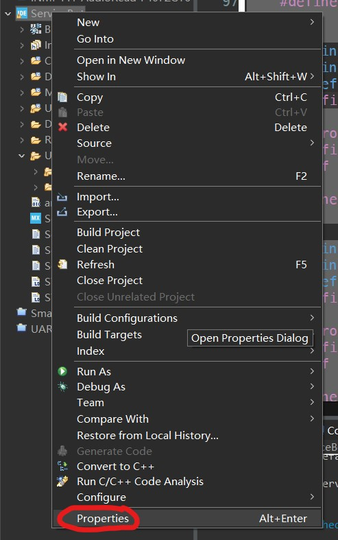
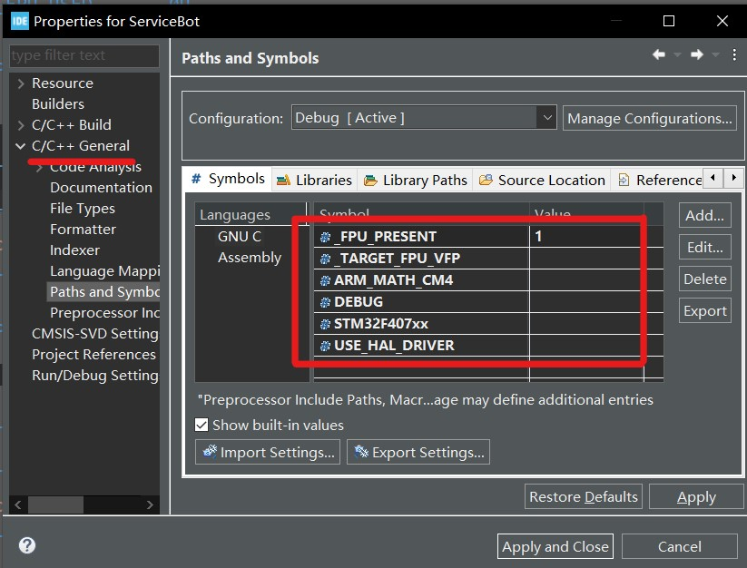

# 关于浮点运算单元

## 目录

## 1. 为什么要用浮点运算单元？

## 2. 什么MCU有浮点运算单元？

## 3. 不同MCU开启浮点运算单元的标准方法

### 3.1 STM32

#### 3.1.1 使用STM32CubeIDE

如果MCU自带浮点运算单元，那么STM32CubeIDe会自行生成浮点运算单元指令。

查看是否确实生成了浮点运算单元控制指令的方法：

1. 在main函数里面写一些浮点运算代码
1. 点击小锤子进行编译
2. 连接上ST-Link，开始调试
3. 依次点击软件最上面一行的Window->Show View->Disassembly打开汇编指令窗口
4. 在汇编指令窗口最上面的小输入框输入main回车，STM32CubeIDE会自己转到main函数的汇编指令部分
5. 往下翻找到自己写的浮点运算代码部分，看看是否有xxx.f32的这种指令，如果有，那么开启FPU就实锤了

#### 3.1.2 使用Keil5 MDK

<a href="https://blog.csdn.net/jaysur/article/details/108928490">STM32F4+CubeMX+Hal库下使能FPU</a>

### 3.2 MSP432

（待补充）

## 4. 使用DSP库函数进行快速计算

### 4.1 STM32CubeIDE

<a href="https://blog.csdn.net/qq_27158179/article/details/100173275">STM32CubeIDE下使能STM32F4的FPU同时调用DSP库计算正弦函数</a>

##### 加入代码文件

STM32F4对应的库文件是arm_cortexM4lf_math.lib：

`C:\Users\用户名\STM32Cube\Repository\STM32Cube_FW_F4_V1.24.0\Drivers\CMSIS\Lib\ARM\arm_cortexM4lf_math.lib`

头文件有三个，路径是
`C:\Users\用户名\STM32Cube\Repository\STM32Cube_FW_F4_V1.24.0\Drivers\CMSIS\DSP\Include`

源文件是一些math运算，在arm中优化过的。有不少文件夹，直接复制粘贴到工程源文件目录内。

`C:\Users\用户名\STM32Cube\Repository\STM32Cube_FW_F4_V1.24.0\Drivers\CMSIS\DSP\Source`

##### 加入全局宏定义

右键工程，选属性。在C/C++ General -> Paths and Symbols 中的Symbols增加以下定义

__FPU_PRESENT，且数值1

__TARGET_FPU_VFP

ARM_MATH_CM4

网上有人说还要加一个宏定义`__FPU_USED`其实是不用的。因为core_cm4.h文件里面已经定义了这个宏。

在程序要用DSP的时候就`include "arm_math.h"`就行，然后就可以用里面的函数了。

### 4.2 Keil5 MDK

类似上文

### 4.3 CCS（MSP432）

（待补充）

## 4. CarOS对于不同MCU的处理

