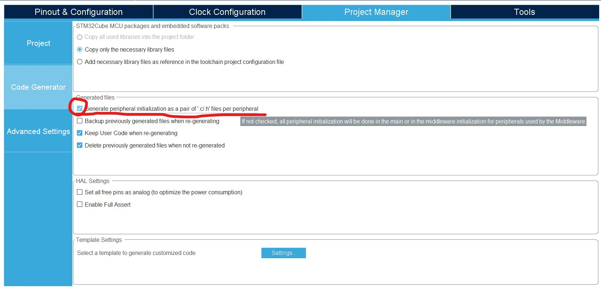
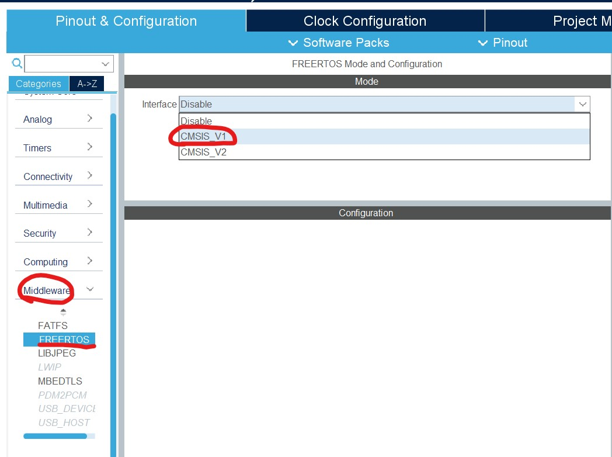
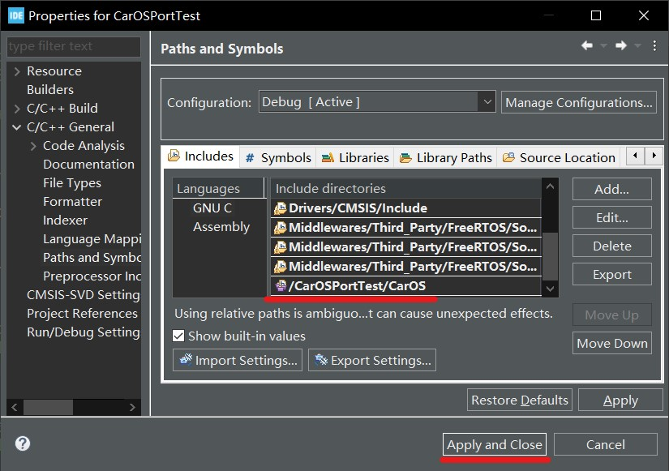

# CarOS 用户手册

## 目录

[1.项目简介](#1-项目简介)</br>
----[1.1 功能说明](#11-功能说明)</br>
----[1.2 开发想法](#12-开发想法)</br>
[2.开始上手](#2-开始上手)</br>
----[2.1 STM32CubeIDE / STM32CubeMX](#21-stm32cubeide--stm32cubemx)</br>
----[2.2 STM32 Keil5 MDK](#22-stm32-keil5-mdk)</br>
----[2.3 MSP432 CCS](#23-msp432-ccs)</br>
[3.CarOS结构](#3-CarOS结构)</br>
----[3.1 第5层-应用层](#31-第5层-应用层)</br>
----[3.2 第4层-算法层](#32-第4层-算法层)</br>
----[3.3 第3层-电机控制层](#33-第3层-电机控制层)</br>
----[3.4 第2层-电机及芯片驱动层](#34-第2层-电机及芯片驱动层)</br>
----[3.4 第1层-单片机gpio控制层](#35-第1层-单片机gpio控制层)</br>
[4.调试经验分享](#4-调试经验分享)</br>


## 1. 项目简介

### 1.1 功能说明

* 支持4轮麦克纳姆轮小车运动学算法
* 

### 1.2 开发想法

作者大二开始在导师的指导下开始电赛控制组训练，而训练的第一大项内容就是小车。这个小车是四驱麦克纳姆轮小车，但是导师和学长给的代码写的比较冗杂，很多东西混杂在一起，很难看懂，也没有文档，我就想自己写一个小车的代码库，要求如下：

1. 包含多类电机驱动程序
2. 包含多种电机驱动芯片的程序
3. 兼容STM32和MSP432，并且改一个宏定义就能切换单片机
4. 做出新车后，移植代码要非常简单
5. 组件接口标准化，便于拼积木一样快速组建工程代码
6. 移植代码时尽量减少大片的修改，最好是改一个宏定义就可以完成移植。
7. 后期增加各种附带外设的驱动程序和应用程序，接口统一标准化
8. 外设驱动和应用程序单独拿出来也要能用
9. 稳定性和鲁棒性要相当好，否则电赛就会出问题
10. 适配FreeRTOS

要求总结：

1. 模块具有独立性和协作性
2. 可移植性高
3. 鲁棒性高
4. 系统稳定性高
5. 文档齐全
6. 调试手段丰富，调试接口齐全

## 2. 开始上手

### 2.1 STM32CubeIDE / STM32CubeMX

#### 选择MCU型号并创建工程


#### 配置STM32CubeIDE工程代码结构



#### 配置时钟

一般来说STM32板子都会外置晶振，所以我们配置外部晶振输入引脚。


切换到`Clock Configuration`界面，把下图红色圈的两个地方选中，等于是启用了外部晶振，其他型号的MCU时钟树可能跟这个不一样，不过大同小异，只要把外部晶振连到内部的一条线全部选中连起来就好了。在红色方框部分填入该MCU最高频率按回车，系统会自动配置时钟树。


#### 配置电机驱动或其他外设所需要的GPIO

在此以设置L298N的逻辑控制GPIO为例。


#### 配置电机用的定时器

##### 产生PWM波的定时器

一般用STM32的高级定时器，Timer1 或 Timer5.


##### 用作编码器的定时器

点开其他定时器的配置页面，把`Combined Channels`设置为`Encoder Mode`。设置了编码器模式之后，下图中其它选项会自动配置，不用改。


将下图的`Encoder Mode`改为`Encoder Mode TI1 and TI2`。其他的选项都不用改。照此设置与小车轮子数量相同的用作编码器的定时器。


#### 串口配置

首先配置一个串口用作控制台。

按下图配置红圈中的三项。串口波特率自己根据情况自己设置。


按下图配置设置串口DMA发送。


#### 配置FreeRTOS

按下图开启FreeRTOS



设置一些配置项。


创建处理io设备输入输出的任务。注意下图中的`Stack Size(Word)`选项要设置得大一些。


创建处理车体运动的任务。


#### 设置NVIC中断向量控制器

打开所有串口的中断。


#### 加入CarOS代码

将CarOS文件夹复制到工程项目根目录，按如下操作包括CarOS到工程中。





#### 部署CarOS

##### 全局宏定义配置

打开`CarOS/c_config.h`文件，按照文件中的注释配置你的校车系统，一般来说需要根据硬件情况修改以下几个配置项。

1. 设置硬件平台，根据用户是STM32还是MSP432

```c
/*****************************************************************************************************
 *                                                                                                   *
 *                                           MCU                                                     *
 *                                                                                                   *
 *****************************************************************************************************/
#define USE_STM32                  1
#define USE_MSP432                 0
```

2. 如果使用的是STM32，请按照实际情况设置。
```c
/*****************************************************************************************************
 *                                                                                                   *
 *                                    STM32 configurations                                           *
 *                                                                                                   *
 *****************************************************************************************************/
#if USE_STM32
    #define USE_HAL_LIB            1      // use hal library, usually developed with STM32CubeIDE or STM32CubeMX
    #define USE_FW_LIB             0      // use firmware library, usually developed with keil5
    #define USE_STM32F4            1      // use STM32F4 series, with FPU
    #define USE_STM32F1            0      // use STM32F1 series, without FPU
    #define USE_STM32G4            0      // use STM32G4 series, with FPU
#endif
```

3. 设置小车的模型。
修改最后一项`CAR_TYPE`为上面的8项中的其中一个。
```c
/*****************************************************************************************************
 *                                                                                                   *
 *                                      Car Configuration                                            *
 *                                                                                                   *
 *****************************************************************************************************/
#define FOUR_WHEEL_MECANUM      1
#define SIX_WHEEL_MECANUM       2
#define TWO_WHEEL_BALANCE       3
#define AKERMAN                 4
#define FOUR_WHEEL_DIFFERENTIAL 5
#define TWO_WHEEL_DIFFERENTIAL  6
#define THREE_WHEEL_OMNI        7
#define FOUR_WHEEL_OMNI         8
#define CAR_TYPE FOUR_WHEEL_MECANUM  // Choose the model of the car
```

##### 串口

**加入CarOS内置io设备处理函数**

打开工程根目录下`Core/Src/stm32xxx_it.c`这个关于中断的文件，找到刚刚设置的串口的中断服务函数，它原本应该是这个样子：

```c
/**
  * @brief This function handles USART2 global interrupt.
  */
void USART2_IRQHandler(void)
{
  /* USER CODE BEGIN USART2_IRQn 0 */

  /* USER CODE END USART2_IRQn 0 */
  HAL_UART_IRQHandler(&huart2);
  /* USER CODE BEGIN USART2_IRQn 1 */
  
  /* USER CODE END USART2_IRQn 1 */
}
```

找到`Core/Src/usart.c`中的`MX_USARTx_UART_Init(void)`(x为串口编号)，在最后添加一行，其中huartx中的x是数字，是那个串口中断函数所属的串口号。
```c
io_UartRxIntHandler(&huartx);
```

就像这样：
```c
/**
  * @brief This function handles USART2 global interrupt.
  */
void USART2_IRQHandler(void)
{
  /* USER CODE BEGIN USART2_IRQn 0 */

  /* USER CODE END USART2_IRQn 0 */
  HAL_UART_IRQHandler(&huart2);
  /* USER CODE BEGIN USART2_IRQn 1 */
  io_UartRxIntHandler(&huart2);
  /* USER CODE END USART2_IRQn 1 */
}
```
打开工程根目录下`Core/Src/stm32xxx_it.c`这个关于中断的文件，找到刚刚设置的串口DMA的中断服务函数，它原本应该是这个样子：
```c
/**
  * @brief This function handles DMA1 stream6 global interrupt.
  */
void DMA1_Stream6_IRQHandler(void)
{
  /* USER CODE BEGIN DMA1_Stream6_IRQn 0 */

  /* USER CODE END DMA1_Stream6_IRQn 0 */
  HAL_DMA_IRQHandler(&hdma_usart2_tx);
  /* USER CODE BEGIN DMA1_Stream6_IRQn 1 */

  /* USER CODE END DMA1_Stream6_IRQn 1 */
}
```

添加代码后应该是这个样子：
```c
/**
  * @brief This function handles DMA1 stream6 global interrupt.
  */
void DMA1_Stream6_IRQHandler(void)
{
  /* USER CODE BEGIN DMA1_Stream6_IRQn 0 */

  /* USER CODE END DMA1_Stream6_IRQn 0 */
  HAL_DMA_IRQHandler(&hdma_usart2_tx);
  /* USER CODE BEGIN DMA1_Stream6_IRQn 1 */
  io_TransOverHandler(&huart2);
  /* USER CODE END DMA1_Stream6_IRQn 1 */
}
```

##### io处理

打开工程根目录下`Core/Src/freertos.c`文件，首先`#include "cos.h"`，在里面找到刚刚在配置FreeRTOS时创建的任务函数`CarOSioProc()`函数，它最原始的时候应该长这样：
```c
/* USER CODE BEGIN Header_CarOSioProc */
/**
* @brief Function implementing the Task_CarOSioProc thread.
* @param argument: Not used
* @retval None
*/
/* USER CODE END Header_CarOSioProc */
void CarOSioProc(void const * argument)
{
  /* USER CODE BEGIN CarOSioProc */
  /* Infinite loop */
  for(;;)
  {
    osDelay(1);
  }
  /* USER CODE END CarOSioProc */
}
```

添加io处理函数后变为：
```c
/* USER CODE BEGIN Header_CarOSioProc */
/**
* @brief Function implementing the Task_CarOSioProc thread.
* @param argument: Not used
* @retval None
*/
/* USER CODE END Header_CarOSioProc */
void CarOSioProc(void const * argument)
{
  /* USER CODE BEGIN CarOSioProc */
  /* Infinite loop */
  for(;;)
  {
    io_Process();
  }
  /* USER CODE END CarOSioProc */
}
```

io处理的任务没有设置延时，但是之前在图形化配置FreeRTOS任务的时候把io处理任务设置优先级为idle，即空闲时就处理io设备，有其他任务的时候就做其他任务。


##### 车体运动学处理

打开工程根目录下`Core/Src/freertos.c`文件，首先`#include "cos.h"`，在里面找到刚刚在配置FreeRTOS时创建的任务函数`CarProcess()`函数，它最原始的时候应该长这样：

```c
/* USER CODE BEGIN Header_CarProcess */
/**
* @brief Function implementing the Task_CarProcess thread.
* @param argument: Not used
* @retval None
*/
/* USER CODE END Header_CarProcess */
void CarProcess(void const * argument)
{
  /* USER CODE BEGIN CarProcess */
  /* Infinite loop */
  for(;;)
  {
    osDelay(1);
  }
  /* USER CODE END CarProcess */
}
```

加入小车运动学处理函数后变为：
```c
/* USER CODE BEGIN Header_CarProcess */
/**
* @brief Function implementing the Task_CarProcess thread.
* @param argument: Not used
* @retval None
*/
/* USER CODE END Header_CarProcess */
void CarProcess(void const * argument)
{
  /* USER CODE BEGIN CarProcess */
  TickType_t xLastWakeTime;
  const TickType_t xFrequency = 10;
  xLastWakeTime = xTaskGetTickCount();
  /* Infinite loop */
  for(;;)
  {
    vTaskDelayUntil( &xLastWakeTime, xFrequency );
    Car_AdjustedVelocity(&Car);
  }
  /* USER CODE END CarProcess */
}
```

#### 配置小车零件

打开工程根目录`Core/Src/main.c`在main函数初始化STM32硬件外设之后添加CarOS内核初始化和小车零件初始化。以L298N驱动直流电机的4轮麦克纳姆轮小车为例，其他类型的小车或驱动使用的初始化函数都是一样的，只不过根据不同车型，初始化函数参数有些不一样。

```c
int main()
{
    ...
    /* 首先进行内核初始化 */
    CarKernelInit();

    /* 在CarOS/src/car/c_xwheel_xxxx.c中已有电机结构体的声明和定义，如DCMotor LeftFrontMotor; */
    /* 对直流电机进行初始化 */
    DCMotor_Init(&LeftFrontMotor, "Left Front Motor", 32, 0, 16800);
    /* 为直流电机添加编码器，如果不使用编码器则可以不用添加 */
    DCMotor_AddEncoder(&LeftFrontMotor, &htim2, 1560, 10);
    /* 为直流电机添加PID速度环控制算法，CarOS设有多种类型的速度环控制器，如PID、滑模控制、模糊控制等 */
    DCMotor_AddPID(&LeftFrontMotor, 1.2, 1.8, 1.6);
    /* 为直流电机添加驱动，否则电机没办法转起来 */
    DCMotor_AddL298N(&LeftFrontMotor, LFMotor_RotateDirectionCtrl1_GPIO_Port,
                                    LFMotor_RotateDirectionCtrl1_Pin,
                                    LFMotor_RotateDirectionCtrl2_GPIO_Port,
                                    LFMotor_RotateDirectionCtrl2_Pin,
                                    &htim1, TIM_CHANNEL_1);

    /* 其他电机采用类似的办法进行初始化 */
    DCMotor_Init(&LeftRearMotor, "Left Rear Motor", 32, 0, 16800);
    DCMotor_AddEncoder(&LeftRearMotor, &htim3, 1560, 10);
    DCMotor_AddPID(&LeftRearMotor, 1.2, 1.8, 1.6);
    DCMotor_AddL298N(&LeftRearMotor,LRMotor_RotateDirectionCtrl1_GPIO_Port,
                                    LRMotor_RotateDirectionCtrl1_Pin,
                                    LRMotor_RotateDirectionCtrl2_GPIO_Port,
                                    LRMotor_RotateDirectionCtrl2_Pin,
                                    &htim1, TIM_CHANNEL_2);
    DCMotor_Init(&RightFrontMotor, "Right Front Motor", 32, 0, 16800);
    DCMotor_AddEncoder(&RightFrontMotor, &htim4, 1560, 10);
    DCMotor_AddPID(&RightFrontMotor, 1.2, 1.8, 1.6);
    DCMotor_AddL298N(&RightFrontMotor,RFMotor_RotateDirectionCtrl1_GPIO_Port,
                                    RFMotor_RotateDirectionCtrl1_Pin,
                                    RFMotor_RotateDirectionCtrl2_GPIO_Port,
                                    RFMotor_RotateDirectionCtrl2_Pin,
                                    &htim1, TIM_CHANNEL_3);
    DCMotor_Init(&RightRearMotor, "Right Rear Motor", 32, 0, 16800);
    DCMotor_AddEncoder(&RightRearMotor, &htim5, 1560, 10);
    DCMotor_AddPID(&RightRearMotor, 1.2, 1.8, 1.6);
    DCMotor_AddL298N(&RightRearMotor,RRMotor_RotateDirectionCtrl1_GPIO_Port,
                                    RRMotor_RotateDirectionCtrl1_Pin,
                                    RRMotor_RotateDirectionCtrl2_GPIO_Port,
                                    RRMotor_RotateDirectionCtrl2_Pin,
                                    &htim1, TIM_CHANNEL_4);

    /* 初始化小车模型，该函数的参数就是小车运动学模型必不可少的参数 */
    Car_Init(&Car, 7.5, 17, 17.1);

    /* 将初始化好的直流电机绑定为小车的轮子所用的电机 */
    /* 这看起来很不合理，因为用户可能会想：小车的电机不就是轮子吗？
       但是如果我小车想要用一个直流电机来让一根木棒旋转呢？这个电机不是轮子所以不用和小车的轮子进行绑定。 */
    Car_AddWheel(&LeftFrontMotor, &LeftRearMotor, &RightFrontMotor, &RightRearMotor);
}

```

#### 开始调试

小车的串口可以连接一个蓝牙串口模块，电脑上插一个连接了另一个蓝牙串口模块的USB转串口工具，这样就可以实现远程操控小车了。

打开电脑的串口工具，发送`scv 20 40 1`（发送时要勾选“发送新行”选项，也就是在发送过去的字符串末尾加上'\r'和'\n'这两个字符）就可以让小车以正前方逆时针旋转20度的方向，以40cm/s的速度位移，同时以1rad/s的角速度自转。更多命令见小车对应的`CarOS/src/car/c_xwheel_xxxx.c`文件。

### 2.2 STM32 Keil5 MDK

### 2.3 MSP432 CCS

## 3. CarOS结构

层级越高越顶层，层级越低越底层

* 第5层-应用层
* 第4层-算法层
* 第3层-电机控制层
* 第2层-电机及芯片驱动层
* 第1层-单片机GPIO控制层

### 3.1 第5层-应用层

### 3.2 第4层-算法层

#### 3.2.1 麦克纳姆轮逆运动学

#### 3.2.2 卡尔曼滤波

#### 3.2.3 PID控制

#### 3.2.4 避障算法

#### 3.2.5 寻迹算法

### 3.3 第3层-电机控制层

### 3.4 第2层-电机及芯片驱动层
目前支持的电机驱动芯片列表：

直流电机：

- L298N模块（非芯片）

步进电机：

### 3.5 第1层-单片机GPIO控制层

## 4. 调试经验分享

### 4.1 直流电机转速采样速率的问题

由于电机速度环PID控制是不断地从编码器获取数据并计算得出实际速度值再与当前电机速度预设值进行PID算法调节，那么显而易见电机PID算法调节的精度与速度的采样速度有直接关系，换句话说，与获取编码器计数值的频率有直接关系。想要电机速度变化更加精准，那么速度的采样率越高越好，但是现实问题是，单片机读取编码器的速度真的足够快吗？不一定，因为获取编码器数据之后还要进行计算才能得出电机速度，得到电机速度之后还要使用电机驱动调节电机实际速度，所以这样一番操作下来需要消耗一些时间，但这其实用不了多少时间，最耗时间的是`printf()`阻塞式输出，这些时间就是降低编码器读取速率的罪魁祸首。
举个例子，我使用FreeRTOS创建了一个任务，这个任务被设定每10ms执行一次，其内容是读取编码器数据并串口打印。在设置电机速度为40.0的情况下串口显示编码器数值为420，这表明在10ms时间内，电机编码器计了420下。然后在电机速度不变的情况下我设置任务为20ms执行一次，编码器读数依然是420左右，但是理论上来说时间提高一倍，编码器计数值应该也提高一倍。就这样我提高任务的时间间隔，直到把任务的时间间隔从50ms设置为60ms的时候电机编码器的计数值才从420跳到了460左右。
上述实验说明一个问题——我设置任务10ms执行一次，但是实际上任务执行一次就已经需要55ms左右了。

