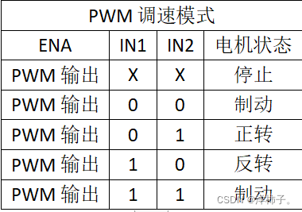

# CarOS-电机模块说明文档

## 目录

[1.简介](#1简介)</br>
[2.直流电机](#2直流电机)</br>
----[2.1 接口说明](#21-接口说明)</br>
----[2.2 代码说明](#22-代码说明)</br>
--------[2.2.1 直流电机对象](#221-直流电机对象)</br>
--------[2.2.2 直流电机速度环控制算法](#222-直流电机速度环控制算法)</br>
--------[2.2.3 直流电机驱动](#223-直流电机驱动)</br>
------------[L298N](#l298n)</br>
------------[A4950](#a4950)</br>
--------[2.2.4 编码器](#224-编码器)</br>
----[2.3 调试](#23-调试)</br>
--------[2.3.1 常见错误](#231-常见错误)</br>
--------[2.3.2 调试方法](#232-调试方法)</br>
----[2.4 扩展方法](#24-扩展方法)</br>
--------[2.4.1 增加新的电机驱动](#241-增加新的电机驱动)</br>
[3.舵机](#3舵机)</br>
[4.步进电机](#4步进电机)</br>
[5.无刷电机](#5无刷电机)</br>

## 1.简介
作为第3层电机控制层，底层接口要连接电机芯片驱动接口，上层要留出提供给算法层的接口。电机模块抽象出了电机模型，模型中有一些描述电机的一些属性。同时电机模块给出了相应的接口函数以控制电机模型。抽象出来的电机模型又与实际的电机控制线进行连接，从而实现抽象模型与电气连接的映射关系。

## 2.直流电机

### 2.1 接口说明

以下函数均是`c_DCMotor.h`暴露给其他模块的API。

*   ```c
    void DCMotor_Init( DCMotor *Motor,
                       const char *Name,
                       AngVelocity_t MaxAngVelocity,
                       uint8_t RotateDirectionReverse,
                       uint32_t PWMCounterPeriod);
    ```

该函数实现电机初始化。此函数所需的参数均为电机结构体最基本的参数。该函数将参数赋值给电机结构体成员。

参数列表：
1. Motor:电机结构体指针
2. Name:电机的名称，为字符串。
3. MaxAngVelocity:电机旋转的最大角速度
4. RotateDirectionReverse:设置电机反转（非必要不开启，可调整接线实现反转）
5. PWMCounterPeriod:定时器产生PWM波的周期。

调用示例：`DCMotor_Init(&LeftFrontMotor, "Left Front Motor", 32, 0, 16800);`

* `void DCMotor_SetVelocity(DCMotor *Motor, AngVelocity_t VelocityVal)`

该函数实现电机速度设置。该函数修改DCMotor.TargetSpeed属性。需要注意的是，单独调用该函数设置电机转速而不调用DCMotorAdjustSpeed()函数，是不会改变电机的转速的，因为DCMotorSetSpeed()函数仅仅只是修改电机模型的目标速度值。需要让电机转速改变，还需要周期性地调用DCMotorAdjustSpeed()。

参数列表：
1. Motor:电机结构体指针
2. VelocityVal:电机旋转角速度

调用示例：`DCMotorSetSpeed(&LeftMotor, 3.14)`

* `DCMotor_AdjustVelocity(DCMotor *Motor)`

该函数实现电机速度环控制(如果该电机启用编码器)以及硬件层面的控制。该函数需要周期性(每隔10ms-80ms)地调用以更新电机速度。该函数内部使用PID算法由目标速度值计算出当前电机转速并将速度值保存在DCMotor.AdjustedSpeed属性中，并将该速度值应用到定时器PWM比较/捕获寄存器中以实现电机转速的修改。

调用示例：`DCMotorAdjustSpeed(&LeftMotor)`

### 2.2 代码说明

#### 2.2.1 直流电机对象

```c
typedef struct DCMotorDefinition
{
    const char       *Name;
    /* velocity controller related */
    void             *VelocityController;
    AngVelocity_t     CurrentVelocity;
    AngVelocity_t     TargetVelocity;
    AngVelocity_t     AdjustedVelocity;
    void            (*ControllerUpdate)(void *,AngVelocity_t,AngVelocity_t);
    void            (*ControllerGetOutVal)(void *,AngVelocity_t*);

    /* traits of dc motor */
    AngVelocity_t     MaxVelocity;
    uint8_t           RotateDirectionReverse;

    /* encoder related */
    uint8_t           EncoderEnable;
    Encoder           Encoder;
    uint32_t          PWMCounterPeriod;

    /* dc motor driver related */
    void             *Driver;
    void            (*DriverSetVelocitycb)(void*, int32_t);
}DCMotor;
```

**简介**

该结构体比较完整地描述了一个直流电机的各种属性，属性介绍详见下文。实例化一个电机对象并且把PWM波相关定时器、电机驱动GPIO作为参数传入该结构体就实现了抽象类型的电机模型与电气连接的映射关系，也即改变电机模型的参数就可以相应地改变电机实际的转速等。这样做的好处是该抽象模型把直流电机相关参数集中到一个结构体里，便于统筹使用。用户只需要关心电机参数如何变化而不用关心底层驱动，这样就更加省心，在调车的时候也更快了。

**成员**

1. **Name**:电机名称
2. **VelocityController**:速度控制器，采用速度环闭环控制。该成员是void*类型指针，可以是各种速度控制器对象结构体指针。该指针用于传入`ControllerUpdate()`和`ControllerGetOutVal()`回调函数。
3. **CurrentVelocity**:该速度值是由编码器计算出来的真实速度值。该值会在调用`DCMotorAdjustSpeed()`函数之后更新。
4. **TargetVelocity**:目标速度值。
5. **AdjustedVelocity**:速度控制器通过算法让电机实际速度向目标速度逼近，在此过程中控制算法（可以是PID也可以是滑模控制等等）计算出预期速度值应用到电机上，这个预期速度就是AdjustedVelocity。
6. **ControllerUpdate**:电机速度控制器更新回调函数指针。该函数指针在电机添加控制器函数`DCMotor_AddXXX()`中被设置为该类控制器的更新函数的指针。
7. **ControllerGetOutVal**:电机速度控制器获取控制器输出值函数指针。该函数指针在调用`DCMotor_AddXXX()`为电机添加控制器时被设置为该类控制器的获取控制器输出值函数的指针。
8. **MaxVelocity**:电机最大旋转角速度。
9. **RotateDirectionReverse**:该属性建议在CarOS初始化时就设置好。当该值为1时，电机会反转（相较于值为0时）。但是不在特殊情况（如开发板接线不能动或者底板电路画反）下建议不要把该值设为1，能改接线就该接线，因为电机反转不是硬件层面的反转，而是软件里面把电机的速度值取相反数而已，所以有的时候这种操作还是不太稳定，有一定风险（没注意int和uint导致负数出问题）。
10. **EncoderEnable**:编码器使能。该值为1时启用编码器。启用编码器的同时也启用速度环控制。
11. **Encoder**:编码器对象，内含一些描述通用编码器的属性及方法等，详见[编码器](#224-编码器)
12. **PWMCounterPeriod**:定时器PWM模式下的计数周期。
13. **Driver**:直流电机驱动器，详见下文[直流电机驱动对象](#223-直流电机驱动对象)
14. **DriverSetVelocitycb**:直流电机驱动器设置电机转速的回调函数的指针。该函数指针在调用`DCMotor_AddXXX()`为电机添加驱动时被设置为XXX驱动器的设置电机速度的函数的指针。


#### 2.2.2 直流电机速度环控制算法

##### PID算法
```c
typedef struct DCMotorSpeedPIDDefinition
{
    float Kp;
    float Ki;
    float Kd;
    MotorSpeed_t CurrentSpeedBias;
    MotorSpeed_t LastSpeedBias;
    MotorSpeed_t BeforeLastSpeedBias;
}DCMotorSpeedPID;
```

*简介*

该模型是速度环闭环控制模型，包含PID参数、数据偏差。PID算法目前在`DCMotorAdjustSpeed()`函数中实现。目前仅有一个PID调节公式：\[Output=K_p\cdot (e_k-e_{k-1})+K_i\cdot (e_k)+K_d\cdot (e_k-2\times e_{k-1}+e_{k-2})\]后期改进可以将算法实现放在该结构体中作为回调函数，同时写多个可备选的PID调节函数以供用户自己选择电机模型使用的PID回调函数。PID算法具体请自行学习。

*成员*

1. Kp：比例控制系数
2. Ki：积分控制系数
3. Kd：微分控制系数
4. CurrentSpeedBias：当前偏差。与下面两个偏差一起参与PID计算过程并在调节过程中不断更新。
5. LastSpeedBias：上一个偏差。
6. BeforeLastSpeedBias：上上一个偏差。

#### 2.2.3 直流电机驱动

**简介**

直流电机驱动通用接口由一个结构体、一个初始化函数、一个设置直流电机转速函数构成。至于结构体里面有什么、设置直流电机转速函数怎么实现，对于直流电机结构体来说，无需知道。直流电机驱动模块和就像笔芯，直流电机模块就像笔杆，插上笔芯，笔就能用，换一个笔芯，笔就能写不同颜色的字。也就是说，直流电机连接上直流电机驱动就能用，换一个直流电机驱动，就能适配不同的硬件。

##### L298N

L298N驱动电机的原理分为2部分，第一部分是PWM电机转速控制；第二部分是电机旋转方向的逻辑控制。每一个L298N驱动的电机由3条线组成，1条PWM线，2条逻辑控制线。调速逻辑如下:



于是有了如下的L298N抽象模型：
```c
typedef struct L298N
{
#if USE_STM32
#if USE_HAL_LIB
	uint16_t              RotationControlGPIOPin1;   // e.g. GPIO_PIN_1
	GPIO_TypeDef         *RotationControlGPIOPort1;  // e.g. GPIOC
	uint16_t              RotationControlGPIOPin2;
	GPIO_TypeDef         *RotationControlGPIOPort2;
	TIM_HandleTypeDef    *PWMGeneratingTimer;        // e.g. htim1
	uint32_t              PWMGeneratingTimerChannel; // e.g. TIM_CHANNEL_1
#elif USE_FW_LIB

#endif
#elif USE_MSP432

#endif

}L298N;
```

当前暂不支持STM32固件库和MSP432，因为还没有在这两个平台上面做实验，后续将会持续更新。不过在HAL库部分的代码可以看到L298N所需的属性就是两个控制逻辑的GPIO口和一个定时器的PWM输出通道。L298N模块只需要控制这几个东西就可以实现对电机的控制。L298N模块已经封装好了，用户所需要做的就只是把L298N的接线按照预设的GPIO口接好就行了。

L298N的初始化函数(基于STM32 HAL库)：
```c
void L298N_Init(void* L298N_instance, GPIO_TypeDef *Port1, uint16_t Pin1, GPIO_TypeDef *Port2, uint16_t Pin2, TIM_HandleTypeDef *htim, uint32_t Channel)
{
    L298N* pL298N = (L298N*)L298N_instance;
    pL298N->RotationControlGPIOPin1 = Pin1;
    pL298N->RotationControlGPIOPort1 = Port1;
    pL298N->RotationControlGPIOPin2 = Pin2;
    pL298N->RotationControlGPIOPort2 = Port2;
    pL298N->PWMGeneratingTimer = htim;
    pL298N->PWMGeneratingTimerChannel = Channel;
    /* firstly start pwm generation, otherwise timer won't generate pwm wave */
    HAL_TIM_PWM_Start(pL298N->PWMGeneratingTimer,pL298N->PWMGeneratingTimerChannel);
}
```

L298N的设置电机速度函数(基于STM32 HAL库)：

```c
void L298N_SetMotorVelocity(void* L298N_instance, int32_t TimerCounterLoadVal)
{
    L298N* pL298N = (L298N*)L298N_instance;
    if(TimerCounterLoadVal==0)
    {
        __HAL_TIM_SET_COMPARE(pL298N->PWMGeneratingTimer, pL298N->PWMGeneratingTimerChannel, 2);
        L298N_StopMotor(pL298N);
    }
    else if(TimerCounterLoadVal>0)
    {
        L298N_SetRotateForward(pL298N);
        __HAL_TIM_SET_COMPARE(pL298N->PWMGeneratingTimer, pL298N->PWMGeneratingTimerChannel, (uint32_t)TimerCounterLoadVal);
    }
    else
    {
        L298N_SetRotateBackward(pL298N);
        __HAL_TIM_SET_COMPARE(pL298N->PWMGeneratingTimer, pL298N->PWMGeneratingTimerChannel, (uint32_t)abs(TimerCounterLoadVal));
    }
}
```
直流电机添加L298N驱动的函数(基于STM32 HAL库)：

```c
void DCMotor_AddL298N(DCMotor *Motor, GPIO_TypeDef *Port1, uint16_t Pin1, GPIO_TypeDef *Port2, uint16_t Pin2, TIM_HandleTypeDef *htim, uint32_t Channel)
{
    L298N *NewL298N = (L298N*)cos_malloc(sizeof(L298N));
    if(NewL298N) // allocate memory successfully
    {
        L298N_Init(NewL298N, Port1, Pin1, Port2, Pin2, htim, Channel);

        /* mount L298N instance on motor */
        Motor->Driver = NewL298N;

        /* set velocity application function as L298N's */
        Motor->DriverSetVelocitycb = L298N_SetMotorVelocity;

        /* if the motor doesn't have name, that means the motor has not been initialized yet */
        if(Motor->Name!=NULL)
        {
            COS_Logf(info, "%s has mounted L298N driver.", Motor->Name);
        }
        else
        {
            COS_Logf(warning, "L298N driver is mounted, but motor hasn't been initialized yet. Make sure initialize motor before mount driver.");
        }
    }
    else
    {
        COS_Logf(warning,"%s mount L298N driver fail:stack have no space, check memory module or increase memory size.", Motor->Name);
    }
}
```

##### A4950

（尚未进行A4950芯片的开发）


#### 2.2.4 编码器

编码器由STM32定时器实现。高阶STM32的某些定时器具有Encoder模式，刚好适配电机编码器的AB相，用户只需要在STM32CubeIDE或者STM32CubeMX里面设置定时器工作在Encoder模式然后把线接好即可实现编码器的功能，而有些低阶STM32没有Encoder模式就必须使用传统的定时器比较捕获手段来实现编码器。在CarOSv1.1版本之前均没有传统定时器比较捕获模式采集编码器数据的程序。

编码器抽象模型如下(基于STM32 HAL库)：

```c
typedef struct EncoderDefinition
{
	TIM_HandleTypeDef *htim;
	short              CurrentCount;
	uint16_t           PulsePerRound;
	uint16_t           Interval;  // unit:ms
}Encoder;
```
1. **htim**:用作编码器的定时器指针。
2. **CurrentCount**:当前获取到的编码器计数值。编码器计数值是在某一时间段内定时器读取到的来自电机编码器的电平次数。注意在高级STM32的定时器的Encoder模式中定时器会读取AB两相的高电平和低电平，俗称四倍频。
3. **PulsePerRound**:电机转一圈读取到的来自电机编码器的脉冲次数。该值一般由电机商家给出。
4. **Interval**:每次读取定时器计数值时的时间间隔，需要与调用函数DCMotorAdjustedSpeed()的时间间隔一致，一般为几十毫秒。单位：ms

### 2.3 调试

#### 2.3.1 常见错误

* **电机不转**

1. 检查电机驱动的接线是否正确
2. 检查电机编码器的接线是否与代码中的设置相符，不要将电机1的AB相的两条线与代码中电机2的两条线接混。
3. 检查直流电机代码配置中是否正确配置电机驱动
4. 逐个轮子进行调试，不要同时调试4个轮子

* **电机乱转**

1. 很有可能四个轮子的编码器AB相的线互相接错了，导致控制算法无法正确地负反馈控制而导致轮子乱转。因此需要逐个轮子进行调试，看看每个轮子的接线是否正确。

#### 2.3.2 调试方法

* 正确搭好整车系统之后，可以通过系统内置命令`smv [vel1][vel2][vel3][vel4]`来单独设置电机转速，看看电机是否按照预期旋转。关于CarOS命令，请阅读“通信”文件夹下的内容。

### 2.4 扩展方法

#### 2.4.1 增加新的电机驱动

**:one:** **创建文件并正确取名**

在`CarOS/src/motor/DCmotor/driver/`文件夹下创建新的文件夹，并命名该新建文件夹为该电机驱动芯片或模块的名字。在你创建好的文件夹中新建一个头文件和一个源文件，命名格式为`XXXX_Driver.h`和`XXXX_Driver.c`

**:two:** **抽象出该电机驱动的模型并写成一个结构体**

结构体中理应必须包含定时器指针和定时器通道，其他结构体成员自己抽象得出。

**:three:** **编写电机驱动初始化函数**

该函数建议命名为`XXX_Init()`。函数参数应该为结构体指针和结构体所有成员，并在函数内将函数参数赋值给电机驱动结构体，最后开启定时器PWM模式开始产生PWM波。

**:four::** **编写设置电机速度的函数**

该函数建议命名为`XXX_SetMotorVelocity()`。该函数参数应该为直流电机驱动结构体指针和一个int32_t类型的比较/捕获值。该函数应该通过改变定时器比较/捕获值来改变PWM波占空比来实现直流电机速度的改变。具体请参照L298N直流电机驱动代码。

**:five:** **编写直流电机挂载驱动函数**

在CarOS/src/motor/DCmotor/driver/DCMotor_driver.h和.c文件中添加代码。在头文件最前面include你的驱动头文件。在.h文件中添加`DCMotor_AddXXX()`函数声明，在.c文件中实现该函数。该函数参数应该为该直流电机驱动结构体指针及该结构体所有成员。该函数中应该调用`cos_malloc()`为结构体分配内存空间，并且调用`XXX_Init()`函数初始化该结构体实例。最后将电机驱动结构体指针赋值给直流电机的速度控制器指针成员。其中适当加入参数检查等逻辑。*详细请参照[L298N](#l298n)有关函数的格式*。

**:six:** **在调试模块中加入有关新驱动的信息**

打开CarOS/c_config.h，在约95行位置找到
```c
/* Motor debug configuration */
#if DEBUG_DCMOTOR==1
	#define DEBUG_L298N   1
	#define DEBUG_A4950   1
#endif
```

在`#define DEBUG_A4950`下面添加`#define DEBUG_XXXX`

打开CarOS/src/debug/c_debug.c约288行左右，在`else if`后面按照前几行代码的格式添加如下：（***假设新驱动芯片叫做RZ7789***）
```c
static uint8_t Log_Filter(const char *file, LogLevel level)
{
    ...
    else if((DEBUG_A4950==0)&&(strstr(file,"A4950")))
    {
        return 0;
    }
    else if((DEBUG_RZ7789==0)&&(strstr(file,"RZ7789")))//新驱动
    {
        return 0;
    }
...
}
```
else if中有字符串`"RZ7789"`,这就是为什么前面需要用户规范好文件名称。日志系统过滤器一部分是利用文件名来过滤的。


## 3.舵机

## 4.步进电机

## 5.无刷电机
