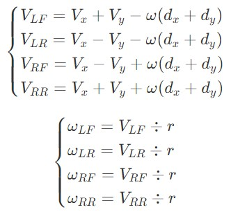
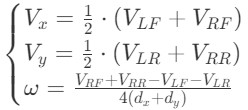

# 4轮麦克纳姆轮小车

## 目录

[1. 简介](#1-简介)</br>
[2. 车轮安装方式](#2-车轮安装方式)</br>
[3. 运动学模型](#3-运动学模型)</br>
----[3.1 逆运动学模型](#31-逆运动学模型)</br>
--------[3.1.1 有什么用?](#311-有什么用)</br>
--------[3.1.2 模型算法](#312-模型算法)</br>
----[3.2 正运动学模型](#32-正运动学模型)</br>
--------[3.2.1 有什么用?](#321-有什么用)</br>
--------[3.2.2 模型算法](#322-模型算法)</br>
[4. API](#4-api)</br>
[5. 代码分析](#5-代码分析)</br>
----[5.1 代码组织结构](#51-代码组织结构)</br>
--------[5.1.1 全局变量](#511-全局变量)</br>
--------[5.1.2 命令及回调函数](#512-命令及回调函数)</br>
--------[5.1.3 运动控制函数](#513-运动控制函数)</br>
----[5.2 抽象模型结构体](#52-抽象模型结构体)</br>

## 1. 简介

4轮麦克纳姆轮小车代码包含运动学模型和控制台调试程序

这是对于4轮麦克纳姆轮小车运动学模型的说明及相应代码`CarOS/src/car/c_xwheel_xxxx.h`和`CarOS/src/car/c_xwheel_xxxx.c`的代码说明，不包含关于4轮麦克纳姆轮小车的寻迹、车道线检测等应用级程序。
## 2. 车轮安装方式

麦轮一般都是四个一组使用，两个左旋轮，两个右旋轮，具体区别如下图所示。


根据四个车轮的辊轴与地面接触所形成的图案的形状，将4轮麦轮车安装方式分为**X型和O型**

**X型**


**O型**


由于X型安装方式力的传导方式不是很合理，导致小车不能很好地完成某些动作，我们**要求使用O型**安装方式。

## 3. 运动学模型

逆运动学模型就是给定小车运动状态，输出车轮旋转速度。

正运动学就是给定车轮旋转速度，输出小车运动状态。

### 3.1 逆运动学模型

#### 3.1.1 有什么用？

用来把用户所要求的运动状况转换为电机速度，从而实现小车运动。

#### 3.1.2 模型算法

**示意图**


x、y轴如图所示。

**公式中将会出现的变量**

* $r$:轮胎半径。

* $d_x$: 左前轮和左后轮（或右前轮和右后轮）几何中心之间的距离。单位：cm

* $d_y$: 左前轮和右前轮（或左后轮和右后轮）几何中心之间的距离。单位：cm

* $V_{x}$: 小车X轴速度。单位：cm/s

* $V_{y}$: 小车Y轴速度。单位：cm/s

* $\omega$: 小车自转角速度。单位：rad/s

* $V_{LF}$: 左前轮旋转产生的线速度。单位：cm/s

* $V_{LR}$: 左后轮旋转产生的线速度。单位：cm/s

* $V_{RF}$: 右前轮旋转产生的线速度。单位：cm/s

* $V_{RR}$: 右后轮旋转产生的线速度。单位：cm/s

* $\omega_{LF}$: 左前轮旋转角速度。单位：rad/s

* $\omega_{LR}$: 左后轮旋转角速度。单位：rad/s

* $\omega_{RF}$: 右前轮旋转角速度。单位：rad/s

* $\omega_{RR}$: 右后轮旋转角速度。单位：rad/s



最终把电机旋转角速度设置为对应电机的角速度就实现了小车的全向移动。

### 3.2 正运动学模型

#### 3.2.1 有什么用？

确实没什么用。

#### 3.2.2 模型算法



## 4. API

### :round_pushpin: 初始化小车模型
```c
void Car_Init(CarType_t *Car_instance, float WheelDiameter, float xAxisWheelDistance, float yAxisWheelDistance)
```

**参数**

1. Car_instance:指向小车结构体的指针。
2. WheelDiameter:轮胎直径。
3. xAxisWheelDistance:左前轮和左后轮（或右前轮和右后轮）几何中心之间的距离。单位：cm
4. yAxisWheelDistance:左前轮和右前轮（或左后轮和右后轮）几何中心之间的距离。单位：cm

**调用示例**
```c
Car_Init(&Car, 7.5, 17, 17.1);
```

### :round_pushpin: 将电机挂载至小车模型
```c
void Car_AddWheel(DCMotor *LeftFront, DCMotor *LeftRear, DCMotor *RightFront, DCMotor *RightRear)
```

**简介**

使小车结构体中指向电机结构体的指针指向电机结构体。

**参数**

1. LeftFront:左前轮电机结构体指针。
2. LeftRear:左后轮电机结构体指针。
3. RightFront:右前轮电机结构体指针。
4. RightRear:右后轮电机结构体指针。

**调用示例**

```c
Car_AddWheel(&LeftFrontMotor, &LeftRearMotor, &RightFrontMotor, &RightRearMotor);
```

### :round_pushpin: 设置小车运动状态
```c
void Car_SetVelocity(CarType_t *Car, Angle_t Angle, LinVelocity_t Velocity, AngVelocity_t AngVelocity)
```

**简介**

设置线速度和角速度。

**参数**

1. Car:指向小车结构体的指针。
2. Angle:位移运动的角度。单位：rad
3. Velocity:位移运动的线速度。单位：cm/s
4. AngVelocity:车身自转角速度。单位：rad/s

**调用示例**

```c
/* 设置小车以3弧度方向40cm/s速度位移，同时以2rad/s的角速度自转 */
Car_SetVelocity(&Car, 3, 40, 2);
```

### :round_pushpin: 调节小车速度
```c
void Car_AdjustedVelocity(CarType_t *Car)
```

**简介**

将目标运动速度值经过运动控制算法之后应用到电机上。

**参数**

1. Car:指向小车结构体的指针。

### :round_pushpin: 小车运动状态闭环控制
```c
void Car_VelocityControl(CarType_t *Car)
```

**简介**

使用姿态传感器等获得小车运动状态并调整小车运动状态。

**参数**

1. Car:指向小车结构体的指针。

## 5. 代码分析

### 5.1 代码组织结构

`CarOS/src/car/c_4wheel_mecanum.h`和`CarOS/src/car/c_4wheel_mecanum.c`的代码主要由一下几部分组成：

1. 全局变量
2. 命令及回调函数
3. 运动控制函数

#### 5.1.1 全局变量

```c
/* 小车结构体 */
CarType_t Car;

/* 车轮电机结构体们 */
DCMotor LeftFrontMotor;
DCMotor LeftRearMotor;
DCMotor RightFrontMotor;
DCMotor RightRearMotor;
```

这些都是全局变量，只要`#include "cos.h"`就能用。

#### 5.1.2 命令及回调函数

* `smv [LF][LR][RF][RR]`
**s**et **m**otor **s**peed.设置电机速度，四个参数分别为LeftFront,LeftRear,RightFront,RightRear的线速度，单位：cm/s

</br>

* `shmpid`
**sh**ow **m**otor **pid**.显示四个电机当前速度环控制pid参数。

</br>

* `smpid [motor_id][Kp][Ki][Kd]`
**s**et **m**otor **pid**.设置电机pid参数。第一个参数是电机编号，0-LeftFront,1-LeftRear,2-RightFront,3-RightRear。

* `scv [degree][linear_velocity][angular_velocity]`
**s**et **c**ar **v**elocity.设置小车运动速度。第一个参数是与x轴所成的角度（单位：度），第二个参数是线速度（单位：cm/s），第三个参数是自转角速度（单位：rad/s）。

#### 5.1.3 运动控制函数

### 5.2 抽象模型结构体

```c
struct FourWheelMecanumModel
{
	DCMotor       *LeftFrontMotor;
	DCMotor       *LeftRearMotor;
	DCMotor       *RightFrontMotor;
	DCMotor       *RightRearMotor;

	float          WheelDiameter;            // unit:cm

	float         xAxisWheelDistance;
	float         yAxisWheelDistance;

	/* measured value */
	LinVelocity_t  CurrentXVelocity;
	LinVelocity_t  CurrentYVelocity;
	AngVelocity_t  CurrentAngularVelocity;

	/* corrected value */
	LinVelocity_t  AdjustedXVelocity;
	LinVelocity_t  AdjustedYVelocity;
	AngVelocity_t  AdjustedAngularVelocity;

	/* target value */
	LinVelocity_t  TargetXVelocity;
	LinVelocity_t  TargetYVelocity;
	AngVelocity_t  TargetAngularVelocity;

};
```